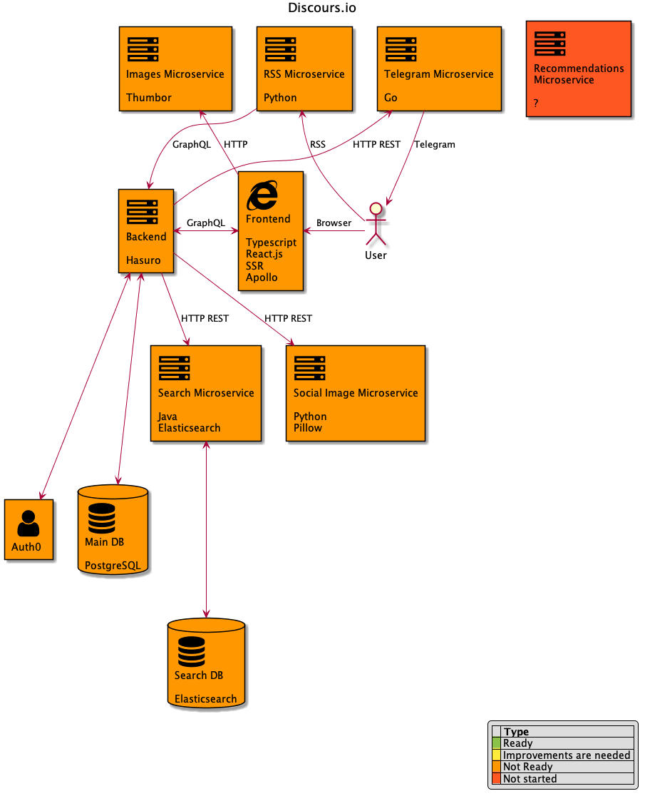

[comment]: # (Редактируйте файл docs/_README.md)

# Разработка проекта Дискурс

> [Дискурс](https://discours.io) является проектом с открытым исходным кодом и каждый желающий может поучаствовать в его разработке.

* [Разработка проекта Дискурс](#)
    * [Манифест разработки Дискурса](#--1)
    * [Архитектура проекта Дискурс](#--2)
    * [Проекты](#--3)

### Манифест разработки Дискурса

 
    

1. Дискурс — открытый проект. Каждый желающий имеет право стать контрибьютором проекта, внести изменения в любой из сервисов проекта и отправить Pull Request.
1. Дискурс — общий проект. Вы всегда можете пообщаться с другими членами команды в [Gitter чате Дискурса](https://gitter.im/Discours/community). Там Вы можете узнать, что сейчас лучше сделать, а также задать любой вопрос по поводу разработки проекта. 
1. Дискурс — проект для читателя. В первую очередь команда выполняет те таски, за которые проголосовали пользователи на [публичной доске задач проекта]().
1. Дискурс — проект для любого разработчика. Мы принимаем микросервисы для backend на любом языке программирования. Но стоит понимать, что мэйнтейнеры проекта не могут знать всех языков, поэтому Dockerfile для запуска микросервиса, понятная документация и тесты (с настроенным CI для их прогона) обязательны в каждом микросервисе.
1. Дискурс — проект для приятной разработки. Команда следит за качеством кода в проекте для того, чтобы новым контрибьюторам было максимально просто влиться в проект. Качество кода - это не только code style и тесты, но и такие субъективные показатели, как читаемость кода и архитектура. Мэйнтейнеры проекта имеют право попросить автора PR изменить код в целях повышения его качества.
1. Дискурс — проект для удобной разработки новых features. Команда Дискурса стремится создать проект, в котором не надо читать весь код для реализации конкретной функциональности. Мы стремимся создать максимально изолированную среду разработки, используя которую каждая фича разрабатывается отдельно. На frontend проектах мы используем [storybook](https://storybook.js.org/) для разработки компонентов и [react-testing-library](https://testing-library.com/docs/react-testing-library/intro) для интеграционного тестирования функциональности компонентов. На backend проектах — разрабатываем используя тесты.
1. Дискурс — проект с открытым манифестом разработки. Каждый желающий может прислать изменения в [данный манифест](https://github.com/Discours/discours-welcome/blob/master/MANIFEST.md).
1. Дискурс — проект доступный. Верстка в проекте должна учитывать пользователей с ограниченными возможностями, то есть необходимо использовать [ARIA аттрибуты](https://developer.mozilla.org/en-US/docs/Web/Accessibility/ARIA).
1. Дискурс — проект без гос. цензуры. Но большая часть наших читателей из РФ, где РосКомНадзор частенько бомбит славный город Воронеж и даже иногда [блокирует сам себя](https://lenta.ru/news/2016/12/12/127001/). Инфраструктура проекта должна быть распределенной, но должна поддерживать быструю смену IP адресов всего, до чего необходимо достучаться пользователю (фронтэнд, бэкэнд, rss микросервис, другие микросервисы доступные пользователю). Нельзя создавать vendor lock на решения, которые не позволяют быстро сменить IP (Cloudflare, Netlify).

### Архитектура проекта Дискурс

### Проекты

Проект | Технологический стэк | Цель | Статус
------ | -------------------- | ---- | -----
[discours-frontend-main](https://github.com/Discours/discours-frontend-main) | Typescript / React | Основной фронтэнд проект. | Не начат
discours-backend-main | ? | Основной бэкенд проект. | Не начат
discours-microservice-images | Python / Thumbor | Сервер (по факту голый [thumbor](https://github.com/thumbor/thumbor)), выдающий изображения в нужном фронтэнду размере и формате (`.webp` выдается автоматически, если браузер поддерживает этот формат). Изображения хранятся на S3. | Ожидает переноса в open source
discours-microservice-search | Java / Elasticsearch | Сервер поиска. Индексирует все статьи на сайте. Получает по HTTP обновления статей от основного бэкенда. Получает по HTTP запрос на поиск и ищет среди индексированного. | Ожидает переноса в open source
discours-microservice-rss | Python | При получении запроса идет на основной бэкэнд за данными и формирует xml файл в формате RSS. | Ожидает переноса в open source
discours-microservice-telegram | Go | Получает от бэкэнда новые статьи и отправляет подписчикам в Telegram. | Ожидает переноса в open source
discours-microservice-social-image | Python / Pillow | Генерирует для бэкэнда изображение, которое будет вставлено в страницу статьи как og:image. В дальнейшем планируется расширение сервиса для генерирования изображения из комментария. | Ожидает переноса в open source
discours-microservice-donate | ? | Микросервис, хранящий всю информацию по пожертвованиям. Имеет интеграцию с [Яндекс.Кассой](https://kassa.yandex.ru/developers/api) (для снятия legacy платежей, полученных до мая 2019) и [Cloudpayments](https://developers.cloudpayments.ru). | Не начат
discours-microservice-recommendations | ? | На основе куки пользователя + информации о логине генерирует 3 рекоммендуемых статьи к определенной статье. | Не начат